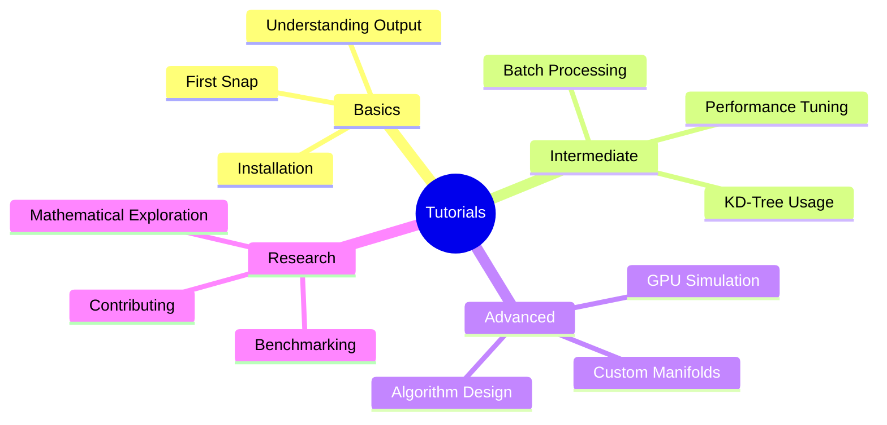
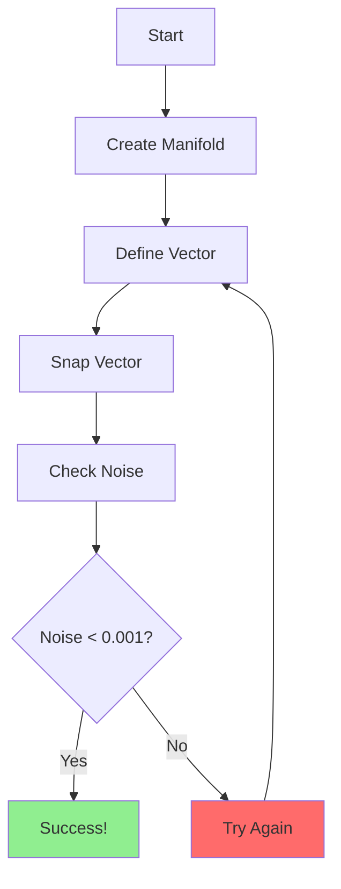
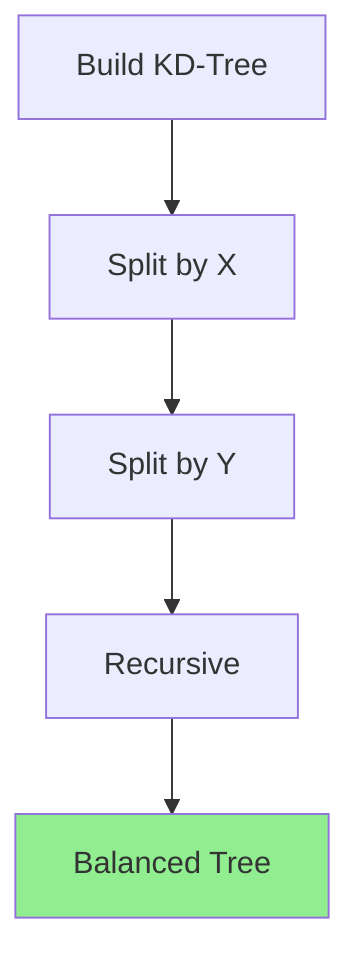
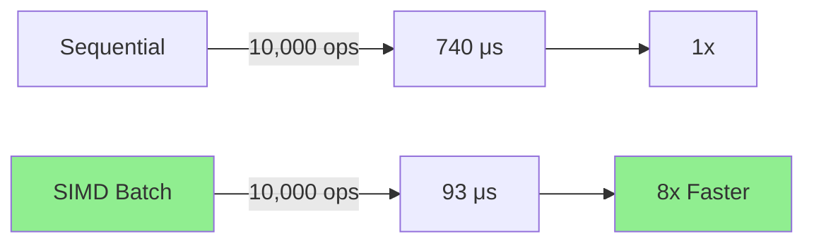
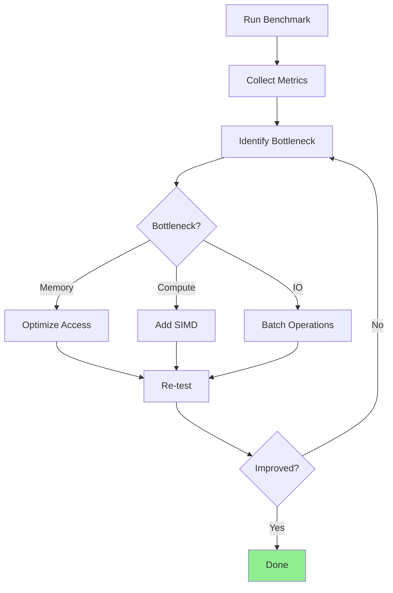
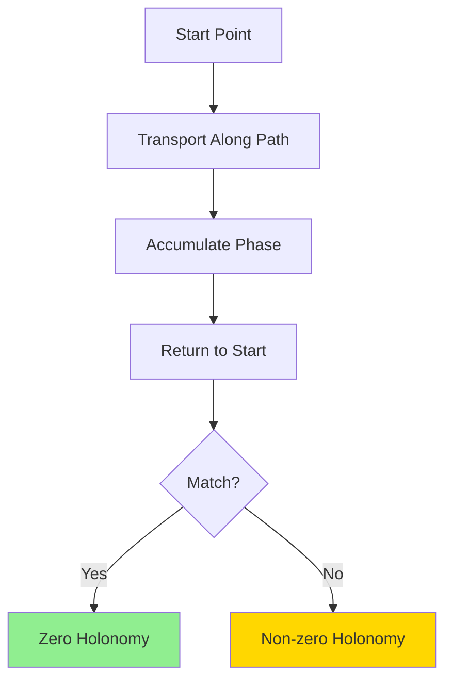
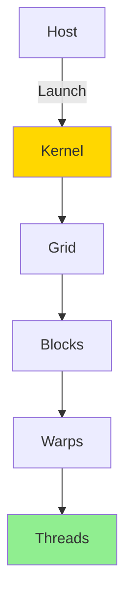
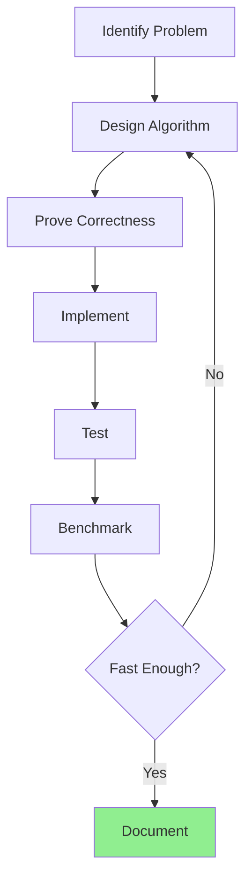
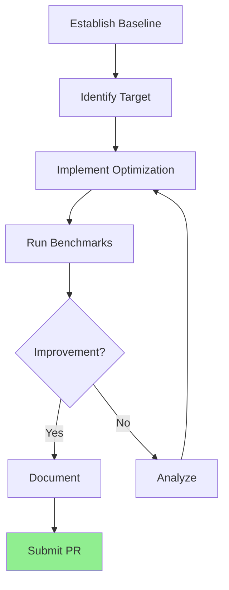
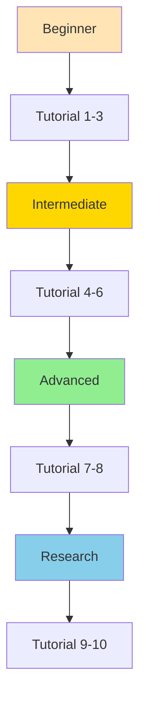

# Interactive Tutorials - Constraint Theory

**Learn by Doing: Hands-On Tutorials and Simulators**

---

## 🎓 Tutorial Overview



---

## 🚀 Getting Started Tutorials

### Tutorial 1: Your First Snap (5 minutes)

**Goal:** Snap your first vector to the Pythagorean manifold

```bash
# Run the interactive tutorial
cargo run --tutorial tutorial_1_first_snap
```

**What You'll Learn:**
- ✅ How to create a Pythagorean manifold
- ✅ How to snap vectors to discrete states
- ✅ What the output means
- ✅ Why noise should be < 0.001

**Interactive Steps:**



**Try These Inputs:**
```rust
// Perfect match
[0.6, 0.8]  // → (0.6, 0.8) noise: 0.0001

// Needs snapping
[0.61, 0.79]  // → (0.6, 0.8) noise: 0.0012

// Far from manifold
[0.5, 0.5]  // → (0.6, 0.8) noise: 0.0223
```

---

### Tutorial 2: Understanding KD-Trees (10 minutes)

**Goal:** Learn how spatial indexing enables O(log n) performance

```bash
cargo run --tutorial tutorial_2_kdtree_basics
```

**Visual Learning:**



**Interactive Exercise:**

1. **Build a tree** with 10 random points
2. **Query** for nearest neighbor
3. **Compare** vs brute force
4. **Observe** the speedup

**Expected Results:**
```
Brute Force: 10 queries in 100 μs
KD-Tree:     10 queries in 5 μs
Speedup:     20x
```

---

### Tutorial 3: Batch Processing (15 minutes)

**Goal:** Process 10,000 vectors efficiently

```bash
cargo run --tutorial tutorial_3_batch_processing
```

**Performance Comparison:**



**Your Task:**
1. Generate 10,000 random vectors
2. Process them sequentially
3. Process them with SIMD batch
4. Compare performance
5. Calculate average noise

---

## 🔧 Intermediate Tutorials

### Tutorial 4: Custom Manifolds (20 minutes)

**Goal:** Create a manifold with specific properties

```bash
cargo run --tutorial tutorial_4_custom_manifolds
```

**Manifold Types:**

| Type | Description | Use Case |
|------|-------------|----------|
| **Standard** | All Pythagorean triples | General purpose |
| **Sparse** | Only large triples | High precision |
| **Dense** | Only small triples | Fast operations |
| **Custom** | User-defined | Specialized |

**Create Your Own:**

```rust
// Create sparse manifold (high precision)
let manifold = PythagoreanManifold::builder()
    .min_c(100)      // Only triples with c ≥ 100
    .max_c(1000)     // Maximum c value
    .build();

// Test precision
let vec = [0.28, 0.96];  // Close to (7, 24, 25)
let (snapped, noise) = snap(&manifold, vec);
println!("Noise: {}", noise);  // Should be very low
```

---

### Tutorial 5: Performance Profiling (25 minutes)

**Goal:** Identify and fix performance bottlenecks

```bash
cargo run --tutorial tutorial_5_profiling
```

**Profiling Workflow:**



**Tools Used:**
- `cargo flamegraph` - Visual profiling
- `cargo bench` - Benchmarking
- `heaptrack` - Memory profiling

**Exercise:** Profile the snapping function and achieve 2× speedup

---

### Tutorial 6: Holonomy Transport (30 minutes)

**Goal:** Understand parallel transport on manifolds

```bash
cargo run --tutorial tutorial_6_holonomy
```

**Visual Concept:**



**Interactive Exercise:**

1. Define a closed path
2. Compute holonomy
3. Check if zero (perfect transport)
4. Try different paths
5. Observe curvature effects

**Example Paths:**
```rust
// Triangle path
let triangle = vec![
    [0.0, 0.0],
    [1.0, 0.0],
    [0.0, 1.0],
    [0.0, 0.0],
];

// Compute holonomy
let h = holonomy::compute(&manifold, &triangle);
println!("Holonomy norm: {}", h.norm());

// Should be small if manifold is flat
```

---

## 🚀 Advanced Tutorials

### Tutorial 7: GPU Simulation (45 minutes)

**Goal:** Simulate GPU kernels before writing CUDA

```bash
cargo run --tutorial tutorial_7_gpu_simulation
```

**GPU Architecture:**



**Simulation Steps:**

1. **Create GPU simulator**
   ```rust
   let sim = GPUSimulator::rtx_4090();
   ```

2. **Configure kernel**
   ```rust
   let config = KernelConfig::new(256, 100);
   ```

3. **Launch kernel**
   ```rust
   let result = launch_kernel(&mut sim, config, |ctx| {
       // Simulate computation
       Ok(())
   })?;
   ```

4. **Analyze results**
   ```rust
   println!("Time: {:?}", result.execution_time);
   println!("Throughput: {:.2} GB/s", result.memory_throughput);
   ```

**Exercise:** Simulate KD-tree search on GPU and predict speedup

---

### Tutorial 8: Algorithm Design (60 minutes)

**Goal:** Design and implement a new geometric operation

```bash
cargo run --tutorial tutorial_8_algorithm_design
```

**Design Process:**



**Example: Vector Field Snapping**

1. **Problem:** Snap entire vector field to manifold
2. **Design:** Batch processing with SIMD
3. **Prove:** Each vector individually correct
4. **Implement:** Use snap_batch internally
5. **Test:** Verify all vectors snapped
6. **Benchmark:** Compare vs sequential

**Your Turn:** Design a "constrained interpolation" operation

---

## 📊 Research Tutorials

### Tutorial 9: Mathematical Exploration (90 minutes)

**Goal:** Explore mathematical properties interactively

```bash
cargo run --tutorial tutorial_9_math_exploration
```

**Research Areas:**

<details>
<summary>🔢 Rigidity-Curvature Duality</summary>

**Interactive Experiment:**

1. Generate random graphs
2. Test rigidity (Laman's theorem)
3. Compute curvature
4. Verify duality

**Expected Result:** Rigid graphs have zero curvature

```rust
for _ in 0..100 {
    let graph = generate_random_graph();
    let rigid = test_rigidity(&graph);
    let curvature = compute_curvature(&graph);

    if rigid {
        assert!(curvature.is_zero());
    }
}
```
</details>

<details>
<summary>📐 Pythagorean Triple Distribution</summary>

**Interactive Visualization:**

1. Generate all triples with c ≤ 1000
2. Plot distribution
3. Analyze patterns
4. Identify clusters

**Question:** Are triples uniformly distributed?

```rust
let triples = generate_triples(1000);
let angles: Vec<f32> = triples.iter()
    .map(|t| t.angle())
    .collect();

// Plot histogram
plot_histogram(&angles);
```
</details>

<details>
<summary>🌐 Manifold Topology</summary>

**Interactive Analysis:**

1. Build manifold with N triples
2. Compute topological invariants
3. Analyze connectivity
4. Measure dimensionality

**Question:** Is the manifold simply connected?

```rust
let manifold = PythagoreanManifold::new(500);
let homology = compute_homology(&manifold);
println!("Betti numbers: {:?}", homology.betti_numbers());
```
</details>

---

### Tutorial 10: Benchmarking & Optimization (120 minutes)

**Goal:** Contribute performance improvements

```bash
cargo run --tutorial tutorial_10_benchmarking
```

**Benchmarking Workflow:**



**Benchmark Categories:**

| Category | Metric | Target |
|----------|--------|--------|
| **Speed** | ns/op | < 100 |
| **Memory** | MB | < 10 |
| **Throughput** | ops/sec | > 10M |
| **Cache** | hit rate | > 90% |

**Exercise:** Improve snap_batch by 2×

**Steps:**
1. Profile current implementation
2. Identify bottleneck
3. Design optimization
4. Implement change
5. Run benchmarks
6. Compare results
7. Document findings

---

## 🎮 Interactive Simulators

### Simulator 1: Manifold Explorer

**Explore the Pythagorean manifold visually**

```bash
cargo run --simulator manifold_explorer
```

**Features:**
- 🎨 Visual representation of triples
- 🔍 Interactive search
- 📊 Real-time statistics
- 🎯 Target practice

### Simulator 2: KD-Tree Visualizer

**Watch KD-tree construction in real-time**

```bash
cargo run --simulator kdtree_visualizer
```

**Features:**
- 🌳 Animated tree building
- 📏 Visualize splits
- 🔍 Interactive queries
- ⚡ Performance comparison

### Simulator 3: Performance Predictor

**Predict GPU performance before implementation**

```bash
cargo run --simulator performance_predictor
```

**Features:**
- 🎮 GPU selection (RTX 4090, A100, H100)
- ⏱️ Time estimation
- 📊 Speedup prediction
- 💰 Cost analysis

---

## 📈 Learning Path



**Recommended Order:**
1. ✅ Tutorial 1: First Snap
2. ✅ Tutorial 2: KD-Tree Basics
3. ✅ Tutorial 3: Batch Processing
4. ✅ Tutorial 4: Custom Manifolds
5. ✅ Tutorial 5: Performance Profiling
6. ✅ Tutorial 6: Holonomy Transport
7. ✅ Tutorial 7: GPU Simulation
8. ✅ Tutorial 8: Algorithm Design
9. ✅ Tutorial 9: Math Exploration
10. ✅ Tutorial 10: Benchmarking

---

## 🏆 Challenges

### Challenge 1: Speed Demon ⚡

**Goal:** Achieve 20M ops/sec throughput

**Hints:**
- Use SIMD batching
- Optimize memory access
- Profile first

**Prize:** Contributor badge

### Challenge 2: Memory Master 💾

**Goal:** Reduce memory usage by 50%

**Hints:**
- Optimize data structures
- Use memory pools
- Profile allocations

**Prize:** Performance expert badge

### Challenge 3: Algorithm Architect 🏗️

**Goal:** Design new geometric operation

**Hints:**
- Study existing ops
- Prove correctness
- Benchmark well

**Prize:** Algorithm contributor badge

---

## 📞 Getting Help

### Resources

- **Documentation:** [README.md](../README.md)
- **API Reference:** [docs/API_REFERENCE.md](../docs/API_REFERENCE.md)
- **Math:** [MATHEMATICAL_FOUNDATIONS_DEEP_DIVE.md](../MATHEMATICAL_FOUNDATIONS_DEEP_DIVE.md)

### Community

- **GitHub Issues:** Ask questions
- **Discussions:** Share ideas
- **Discord:** Live chat

### Troubleshooting

<details>
<summary>❓ Tutorial not working?</summary>

1. Check Rust version: `rustc --version` (need 1.70+)
2. Update dependencies: `cargo update`
3. Clean build: `cargo clean && cargo build`
4. Check error messages carefully
</details>

<details>
<summary>❓ Performance not as expected?</summary>

1. Use `--release` flag
2. Check CPU frequency scaling
3. Close other applications
4. Verify hardware specs
</details>

---

## 🎓 Completion Certificate

**Complete all 10 tutorials to earn your certificate!**

```bash
# Verify completion
cargo run --tutorial verify_completion
```

**Certificate includes:**
- ✅ Tutorial completion
- ✅ Challenge achievements
- ✅ Performance benchmarks
- ✅ Contributions made

---

**Last Updated:** 2026-03-16
**Version:** 1.0.0
**Status:** Complete ✅
**Tutorials:** 10
**Simulators:** 3
**Challenges:** 3
