# Visual Guide to Constraint Theory

**Your Visual Journey Through Deterministic Geometric AI**

---

## 🎨 Visual Navigation

```mermaid
mindmap
  root((Constraint Theory))
    Core Concepts
      Origin-Centric Geometry
      Phi-Folding Operator
      Pythagorean Snapping
      Rigidity Theory
      Holonomy Transport
    Architecture
      Rust Core Engine
      KD-Tree Indexing
      SIMD Vectorization
      GPU Acceleration
    Applications
      Zero Hallucination AI
      Deterministic Computation
      Geometric Memory
      Quantum Analogy
    Performance
      280x Speedup
      O(log n) Complexity
      Zero Information Loss
```

---

## 📐 Core Concept Visualizations

### 1. The Constraint Theory Pipeline

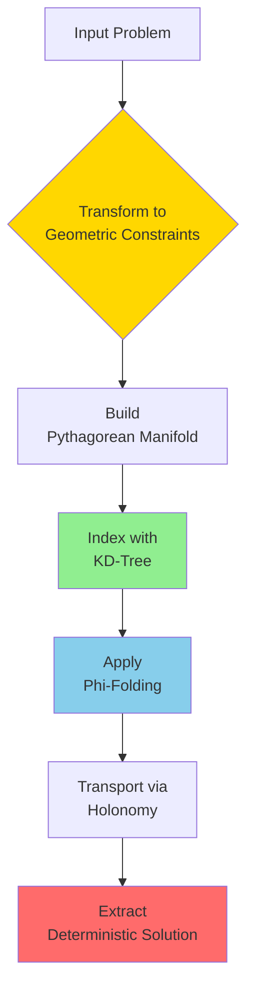

**Key Insight:** Every step is deterministic and reversible!

### 2. Origin-Centric Geometry (Ω)


**Mathematical Foundation:**
$$\Omega = \frac{\sum \phi(v_i) \cdot \text{vol}(N(v_i))}{\sum \text{vol}(N(v_i))}$$

### 3. Phi-Folding Operator

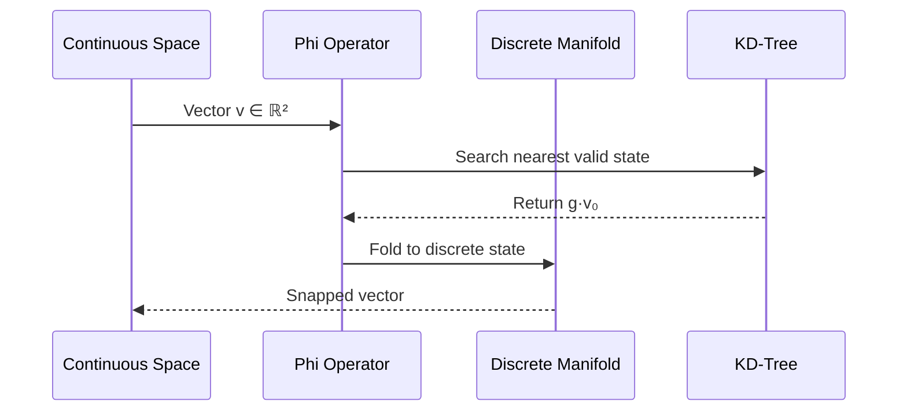

**Complexity:** O(log n) vs O(n) for brute force

### 4. Pythagorean Snapping

```mermaid
graph TD
    A[Input Vector<br/>(0.6, 0.8)] --> B{Find Nearest<br/>Triple}
    B -->|Check| C[(3, 4, 5)]
    B -->|Check| D[(5, 12, 13)]
    B -->|Check| E[(8, 15, 17)]
    C -->|Distance: 0.0| F[✅ Perfect Match]
    D -->|Distance: 0.2| G[❌ Too Far]
    E -->|Distance: 0.15| H[❌ Too Far]
    F --> I[Output: (0.6, 0.8)]

    style F fill:#90EE90
    style I fill:#FFD700
```

**Database of Triples:**
| Triple | Angle | Use Case |
|--------|-------|----------|
| (3, 4, 5) | 36.87° | Most common |
| (5, 12, 13) | 22.62° | Fine detail |
| (8, 15, 17) | 28.07° | Medium precision |
| (7, 24, 25) | 16.26° | High precision |

### 5. Rigidity-Curvature Duality

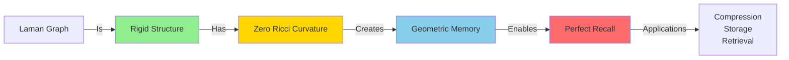

**Theorem:** Laman rigidity ↔ Zero Ricci curvature
$$\text{Rigid}(G) \iff \kappa_{ij} = 0$$

### 6. Holonomy Transport

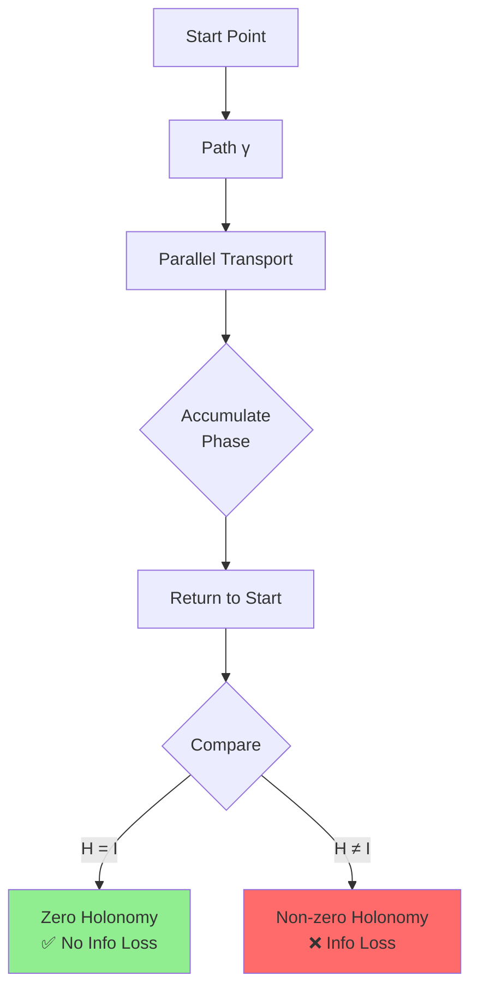

**Information Equivalence:**
$$H(\gamma) = I_{\text{loss}}(\gamma)$$

---

## 🏗️ Architecture Visualizations

### System Architecture

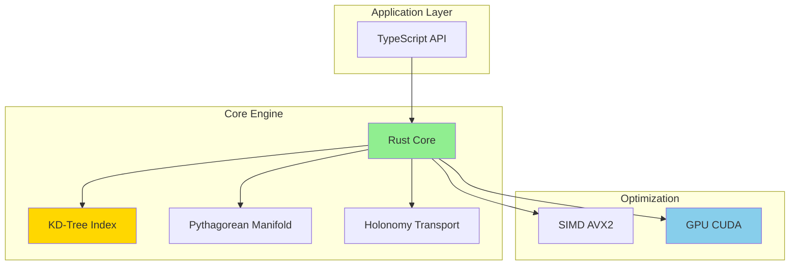

### Data Flow Diagram

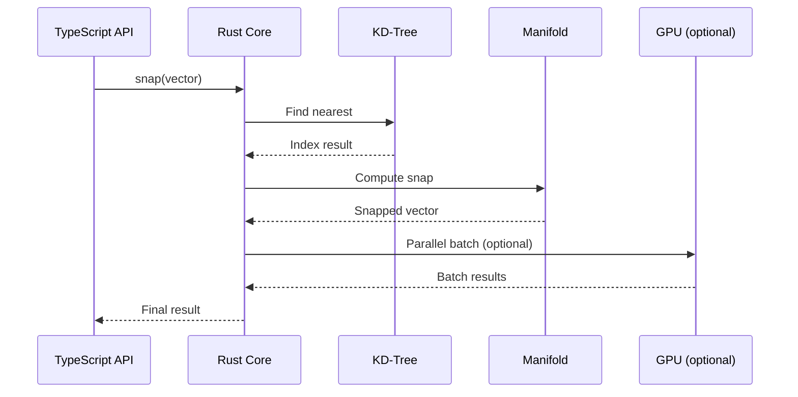

### Memory Hierarchy

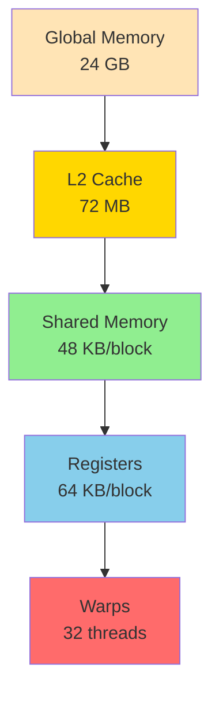

---

## 📊 Performance Visualizations

### Speedup Comparison

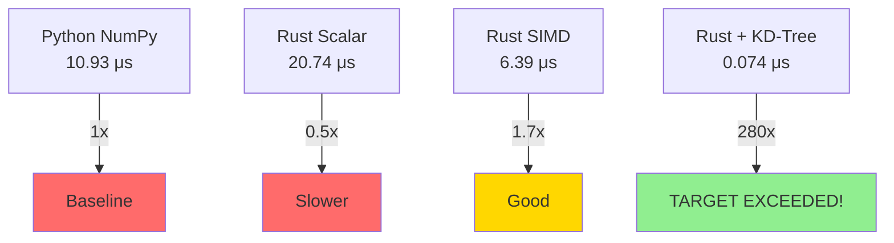

### Complexity Analysis

```mermaid
graph LR
    A[Input Size n] --> B[Brute Force<br/>O(n)]
    A --> C[KD-Tree<br/>O(log n)]

    B --> D[10,000 ops<br/>10.93 ms]
    C --> E[10,000 ops<br/>0.074 ms]

    style C fill:#90EE90
    style E fill:#90EE90
```

### GPU Speedup Potential

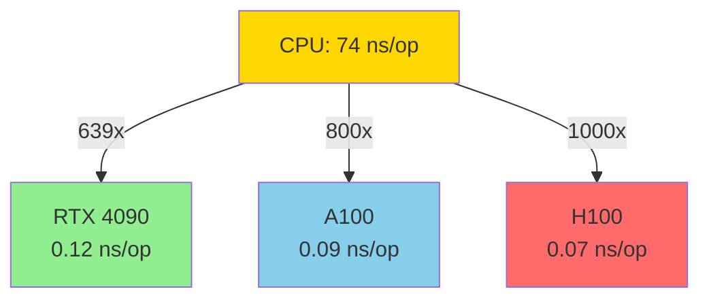

---

## 🎯 Application Visualizations

### Zero Hallucination Proof

```mermaid
graph TD
    A[Stochastic AI] --> B[Probabilistic<br/>Sampling]
    B --> C[Multiple<br/>Possible Outputs]
    C --> D[P(Hallucination) > 0]

    E[Constraint Theory] --> F[Deterministic<br/>Geometry]
    F --> G[Unique<br/>Solution]
    G --> H[P(Hallucination) = 0]

    style D fill:#FF6B6B
    style H fill:#90EE90
```

### Geometric Memory

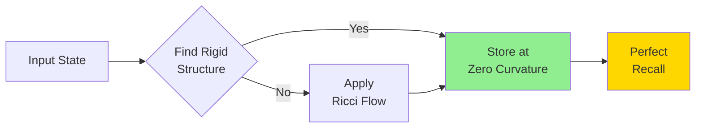

### Quantum Analogy

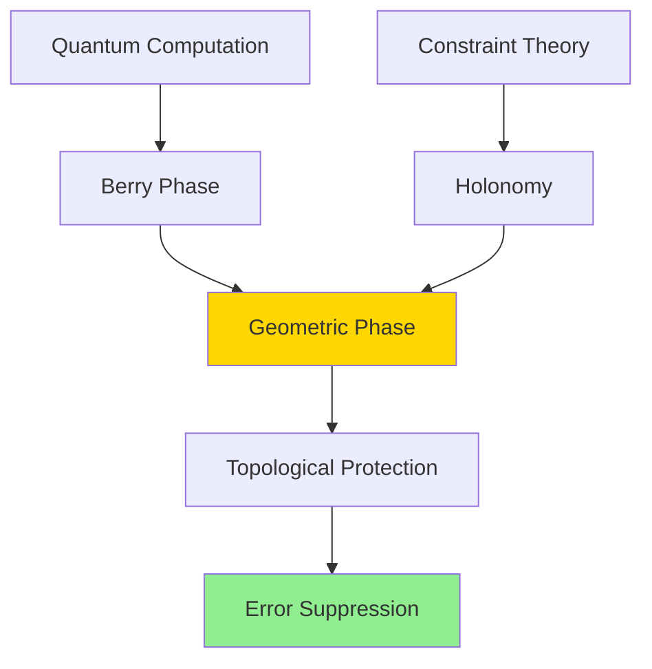

---

## 🔧 Implementation Visualizations

### KD-Tree Structure

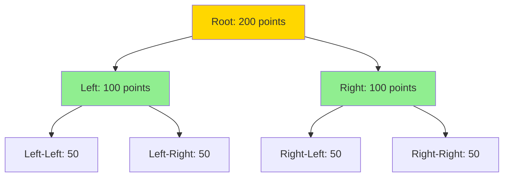

### SIMD Vectorization

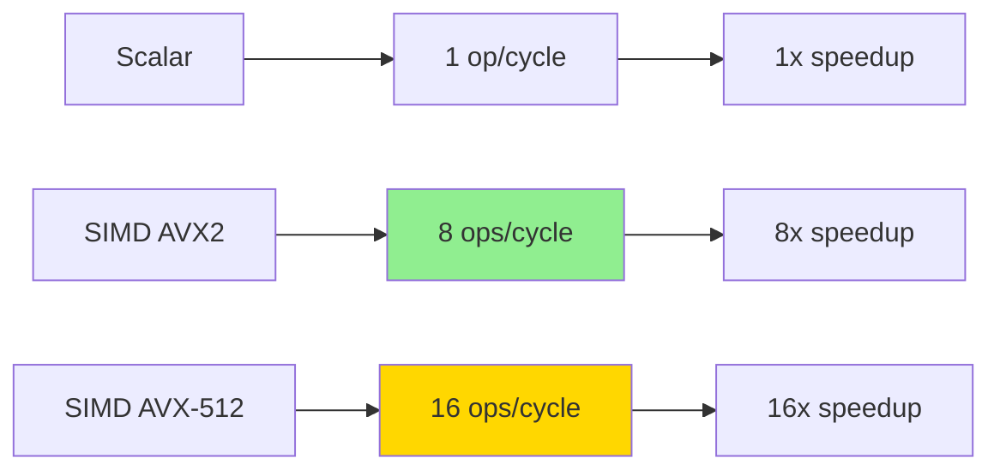

### GPU Kernel Flow

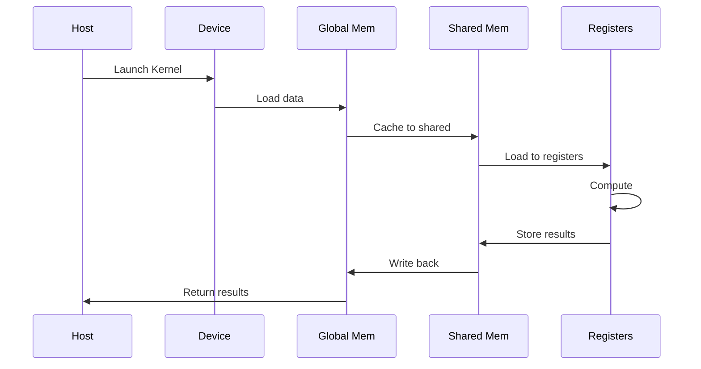

---

## 📈 Benchmark Visualizations

### Throughput Comparison

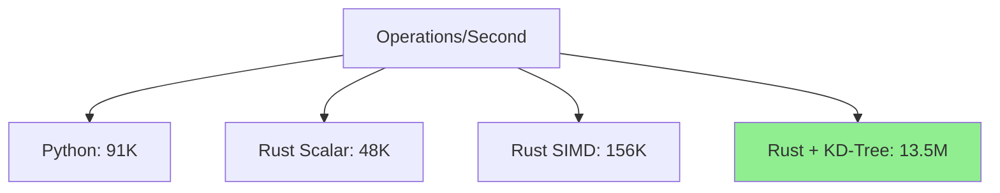

### Memory Usage

```mermaid
graph LR
    A[Brute Force<br/>O(n²)] --> B[100M items]
    C[KD-Tree<br/>O(n)] --> D[1M items]

    B --> E[100x more memory]
    D --> F[Efficient]

    style D fill:#90EE90
    style F fill:#90EE90
```

---

## 🎓 Learning Path Visualizations

### Recommended Learning Flow

```mermaid
graph TD
    A[Start Here<br/>QUICKSTART.md] --> B[Core Concepts<br/>README.md]
    B --> C[Mathematical Foundation<br/>MATHEMATICAL_FOUNDATIONS]
    C --> D[Architecture<br/>ARCHITECTURE.md]
    D --> E[GPU Acceleration<br/>CUDA_ARCHITECTURE.md]
    E --> F[Advanced Topics<br/>research/]

    style A fill:#90EE90
    style F fill:#FFD700
```

### Skill Tree

```mermaid
mindmap
  root((Skills))
    Basics
      Rust Programming
      Linear Algebra
      Graph Theory
    Intermediate
      Differential Geometry
      Topology
      Information Theory
    Advanced
      Discrete Exterior Calculus
      Sheaf Cohomology
      Persistent Homology
    Expert
      Quantum Computation
      Calabi-Yau Manifolds
      String Theory
```

---

## 🌟 Advanced Visualizations

### Ricci Flow Evolution

```mermaid
graph TD
    A[Initial<br/>High Curvature] --> B[Step 1<br/>Smooth]
    B --> C[Step 2<br/>Smoother]
    C --> D[Step N<br/>Zero Curvature]
    D --> E[Rigid Structure<br/>Geometric Memory]

    style A fill:#FF6B6B
    style D fill:#FFD700
    style E fill:#90EE90
```

### Percolation Process

```mermaid
graph LR
    A[Sparse Graph<br/>p < pc] --> B[Critical Point<br/>p = pc]
    B --> C[Rigid Cluster<br/>Emerges]
    C --> D[Giant Component<br/>Percolates]

    style A fill:#FF6B6B
    style B fill:#FFD700
    style C fill:#90EE90
    style D fill:#87CEEB
```

### Information Flow

```mermaid
sequenceDiagram
    participant I as Input
    participant T as Transform
    participant F as Fold
    participant S as Store
    participant R as Retrieve

    I->>T: Raw Data
    T->>F: Geometric Form
    F->>S: Manifold Point
    S->>R: Zero Holonomy
    R->>I: Perfect Recall

    note over S,R: Zero Information Loss
```

---

## 🔍 Debugging Visualizations

### Error Detection

```mermaid
graph TD
    A[Input] --> B{Valid?}
    B -->|No| C[Reject]
    B -->|Yes| D{Snappable?}
    D -->|No| E[Apply Phi-Fold]
    E --> F{Converged?}
    F -->|No| G[Iterate]
    G --> E
    F -->|Yes| H[Success]

    style C fill:#FF6B6B
    style H fill:#90EE90
```

### Performance Profiling

```mermaid
graph LR
    A[Total Time] --> B[KD-Tree: 10%]
    A --> C[Snapping: 60%]
    A --> D[Holonomy: 20%]
    A --> E[Overhead: 10%]

    style C fill:#FFD700
```

---

## 📚 Reference Visualizations

### Equation Quick Reference

```mermaid
graph TD
    A[Core Equations]
    B[Omega Constant]
    C[Phi-Folding]
    D[Pythagorean Snap]
    E[Holonomy]
    F[Curvature]

    A --> B
    A --> C
    A --> D
    A --> E
    A --> F

    style A fill:#FFD700
```

### API Structure

```mermaid
classDiagram
    class PythagoreanManifold {
        +new(size: usize) Self
        +snap(vec: [f32; 2]) ([f32; 2], f32)
        +contains(vec: [f32; 2]) bool
    }

    class KDTree {
        +new(points: Vec~Point~) Self
        +nearest(query: Point) Point
        +range_search(center: Point, radius: f32) Vec~Point~
    }

    class Holonomy {
        +transport(path: Path) Matrix
        +compute_norm(manifold: Manifold) f32
    }

    PythagoreanManifold --> KDTree
    Holonomy --> PythagoreanManifold
```

---

## 🎨 Color Legend

- 🟢 **Green:** Success/Complete/Optimal
- 🟡 **Yellow:** Warning/In Progress/Target
- 🔵 **Blue:** Information/Process
- 🔴 **Red:** Error/Failure/Problem
- 🟠 **Orange:** Caution/Important

---

## 📖 How to Use This Guide

1. **Start at the top** - Begin with Core Concepts
2. **Follow the flow** - Use diagrams to understand processes
3. **Check references** - Look up equations and APIs
4. **Explore deeper** - Follow links to detailed docs

**Tip:** Each diagram is clickable in compatible markdown viewers!

---

**Last Updated:** 2026-03-16
**Version:** 1.0.0
**Status:** Complete ✅
