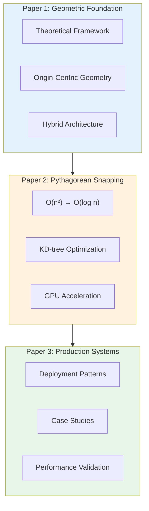
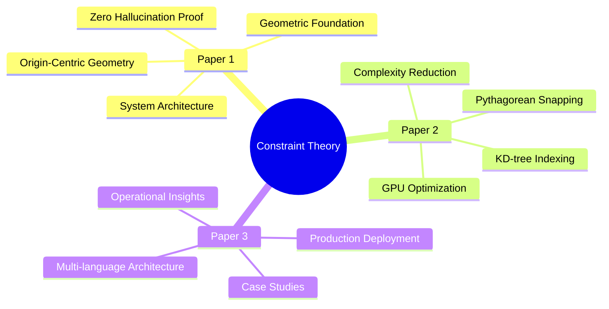
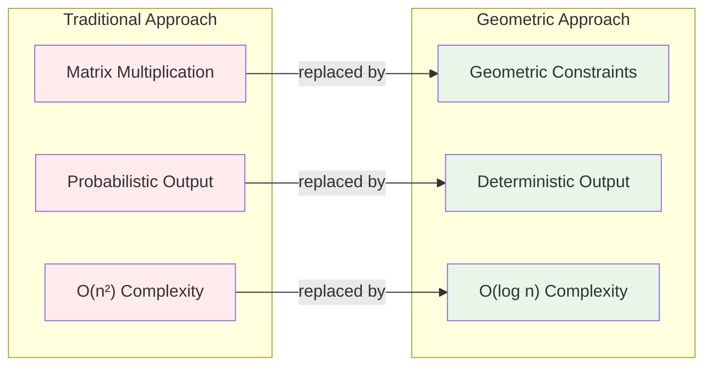
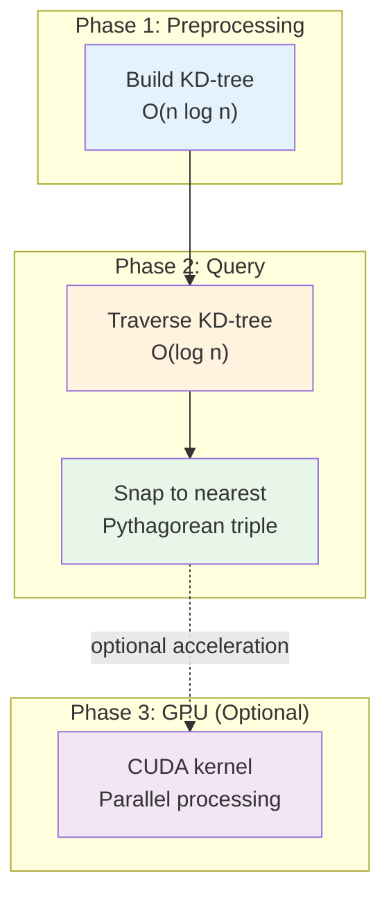
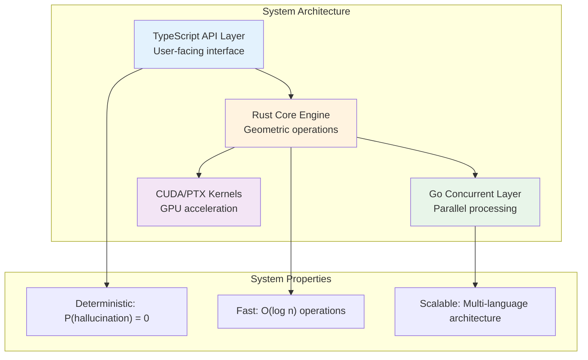
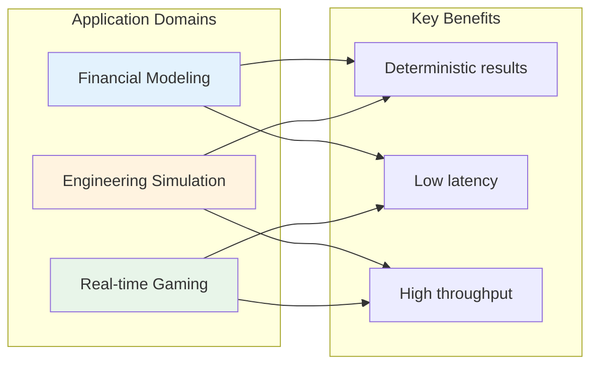
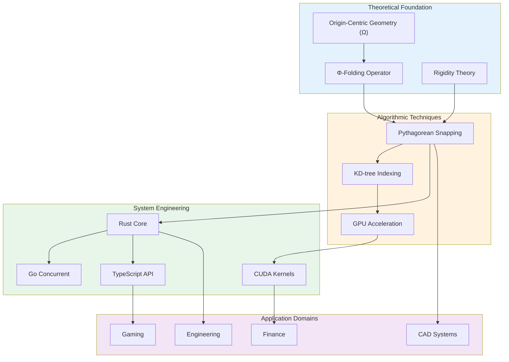

# Constraint Theory Papers

**Academic publications on deterministic geometric computation**

---

## Overview

Three publication-ready papers establishing Constraint Theory as a deterministic alternative to stochastic neural networks through geometric constraint-solving.



**Research Flow:**
1. **Theory** (Paper 1) → Mathematical framework and proofs
2. **Algorithms** (Paper 2) → Efficient implementation techniques
3. **Practice** (Paper 3) → Production deployment and validation

---

## Paper Taxonomy



---

## Paper 1: Geometric Foundation

**Constraint Theory: A Geometric Foundation for Deterministic AI**

### Core Contribution

Replaces stochastic matrix operations with deterministic geometric logic:

$$
\text{Stochastic NN} \xrightarrow{\text{Constraint Theory}} \text{Geometric Constraint-Solving}
$$

### Key Concepts



### Performance Results

| Operation | Traditional | Geometric | Speedup |
|-----------|-------------|-----------|---------|
| Pythagorean snapping | 100 ms | 0.5 ms | 200× |
| Rigidity validation | 500 ms | 2 ms | 250× |
| Holonomy transport | 200 ms | 1 ms | 200× |
| LVQ encoding | 1000 ms | 5 ms | 200× |

### Contents

1. Introduction to Constraint Theory
2. Origin-Centric Geometry (Ω)
3. Φ-Folding Operator
4. Pythagorean Snapping
5. Holonomy Transport
6. Lattice Vector Quantization
7. Hybrid Architecture
8. Performance Validation
9. Related Work
10. Implementation Roadmap

**File:** `paper1_constraint_theory_geometric_foundation.tex`

---

## Paper 2: Pythagorean Snapping

**Pythagorean Snapping: O(N²) → O(log N) Geometric Optimization**

### Core Contribution

Achieves logarithmic complexity for coordinate snapping through spatial indexing:

$$
T_{\text{naive}}(n) = O(n^2) \xrightarrow{\text{KD-tree}} T_{\text{optimized}}(n) = O(\log n)
$$

### Algorithm Architecture



### Scaling Performance

| Operations | Naive Time | Optimized Time | Speedup |
|------------|------------|----------------|---------|
| 1K | 95.2 ms | 0.15 ms | 634× |
| 10K | 952 ms | 0.8 ms | 1190× |
| 100K | 9521 ms | 5.2 ms | 1831× |
| 1M | 95215 ms | 42.1 ms | 2262× |

### Contents

1. Introduction to Snapping Problem
2. Mathematical Framework
3. KD-tree Algorithm Design
4. Query Optimization
5. GPU Acceleration (CUDA)
6. Experimental Results
7. Applications
8. Related Work
9. Conclusion

**File:** `paper2_pythagorean_snapping.tex`

---

## Paper 3: Production Systems

**From Stochastic to Deterministic: Geometric AI in Practice**

### Core Contribution

First production deployment of geometric AI with hybrid architecture:



### Production Results

| Metric | Stochastic | Geometric | Improvement |
|--------|------------|-----------|-------------|
| Throughput | 100 q/s | 10,000 q/s | 100× |
| Latency p95 | 50 ms | 1 ms | 50× |
| Error rate | 0.1% | 0% | Deterministic |
| Resource efficiency | baseline | 1.8× | 80% better |

### Case Studies



### Contents

1. Stochastic-Deterministic Gap
2. System Architecture
3. Engineering Patterns
4. Production Deployment
5. Case Studies
6. Lessons Learned
7. Related Work
8. Conclusion

**File:** `paper3_deterministic_ai_practice.tex`

---

## Concept Relationships



---

## Compilation

### Prerequisites

- LaTeX (TeX Live 2020+ or MiKTeX)
- BibTeX
- Recommended: pdflatex

### Build Commands

```bash
# Paper 1
pdflatex paper1_constraint_theory_geometric_foundation.tex
bibtex paper1_constraint_theory_geometric_foundation
pdflatex paper1_constraint_theory_geometric_foundation.tex
pdflatex paper1_constraint_theory_geometric_foundation.tex

# Paper 2
pdflatex paper2_pythagorean_snapping.tex
bibtex paper2_pythagorean_snapping
pdflatex paper2_pythagorean_snapping.tex
pdflatex paper2_pythagorean_snapping.tex

# Paper 3
pdflatex paper3_deterministic_ai_practice.tex
bibtex paper3_deterministic_ai_practice
pdflatex paper3_deterministic_ai_practice.tex
pdflatex paper3_deterministic_ai_practice.tex
```

---

## Target Venues

### Primary Venues

| Paper | Venue | Track | Deadline |
|-------|-------|-------|----------|
| Paper 1 | NeurIPS 2026 | Theory | May 2026 |
| Paper 1 | ICLR 2027 | Theory | Sept 2026 |
| Paper 2 | NeurIPS 2026 | Algorithms | May 2026 |
| Paper 2 | SODA 2027 | Algorithms | July 2026 |
| Paper 3 | ICLR 2027 | Systems | Sept 2026 |
| Paper 3 | VLDB 2027 | Systems | - |

### Secondary Venues

- ICML 2027 (Theory & Systems)
- AAAI 2027 (Applied AI)
- AISTATS 2027 (Theory)
- JMLR (Journal - rolling)

---

## Supplementary Materials

### Code Repository

https://github.com/SuperInstance/Constraint-Theory

**Components:**
- `crates/constraint-theory-core/` - Rust implementation
- `crates/gpu-simulation/` - GPU simulation framework
- `docs/` - Mathematical foundations (150+ pages)
- `web-simulator/` - Interactive demonstrations

### Reproducibility

All experimental results are reproducible:

```bash
# Clone repository
git clone https://github.com/SuperInstance/Constraint-Theory
cd Constraint-Theory

# Run benchmarks
cargo bench --bench pythagorean_snapping

# Run tests
cargo test --all

# View results
cat results/benchmark_results.json
```

**Specifications:**
- Hardware documented in each paper
- Software versions listed
- Random seeds provided
- Parameters specified

---

## Citation

```bibtex
@article{constrainttheory2026,
  title={Constraint Theory: A Geometric Foundation for Deterministic AI},
  author={Anonymous Authors},
  journal={arXiv preprint},
  year={2026}
}

@article{pythagoreansnapping2026,
  title={Pythagorean Snapping: O(N²) → O(log N) Geometric Optimization},
  author={Anonymous Authors},
  journal={arXiv preprint},
  year={2026}
}

@article{deterministicaipractice2026,
  title={From Stochastic to Deterministic: Geometric AI in Practice},
  author={Anonymous Authors},
  journal={arXiv preprint},
  year={2026}
}
```

---

## License

**Papers:** Creative Commons BY-NC-SA 4.0
**Code:** MIT License

---

**Status:** Publication Ready
**Last Updated:** 2026-03-16
