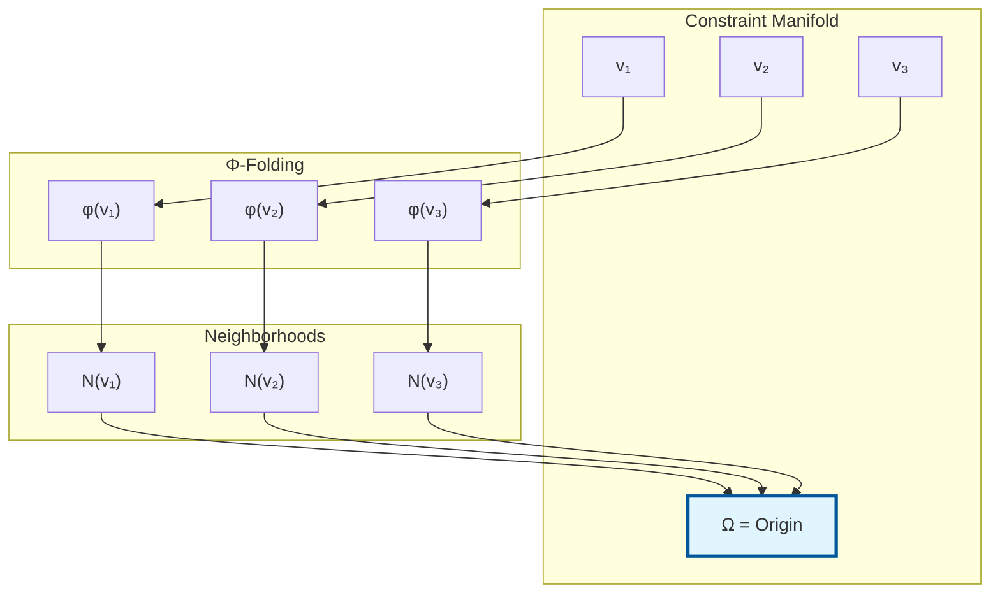

# Origin-Centric Geometry (Ω)

**The Mathematical Foundation of Constraint Theory**
**Version:** 1.0.0
**Last Updated:** 2026-03-16

---

## Overview

Origin-Centric Geometry (Ω) is the mathematical framework that defines the normalized ground state of the constraint manifold. It serves as the absolute reference frame for all geometric operations in the Constraint Theory system.

---

## Table of Contents

1. [Mathematical Definition](#mathematical-definition)
2. [Physical Interpretation](#physical-interpretation)
3. [Properties and Invariants](#properties-and-invariants)
4. [Computational Aspects](#computational-aspects)
5. [Applications](#applications)
6. [Examples](#examples)
7. [See Also](#see-also)

---

## Mathematical Definition

### Formal Definition

The Ω constant is defined as the weighted average of all folded vectors, normalized by neighborhood volume:

$$
\Omega = \frac{\sum \phi(v_i) \cdot \text{vol}(N(v_i))}{\sum \text{vol}(N(v_i))}
$$

Where:
- $\phi(v_i)$ = Folded state of vector $v_i$
- $N(v_i)$ = Neighborhood of vector $v_i$ on the manifold
- $\text{vol}(N(v_i))$ = Volume (measure) of the neighborhood
- The sum runs over all vectors $v_i$ in the manifold

### Intuitive Meaning

Ω represents the **"center of mass"** of the constraint manifold when:
1. Every point is folded to its nearest valid state
2. Each point is weighted by its neighborhood volume
3. The result is normalized to create a unitary reference

### Geometric Interpretation



**Visual interpretation:**
- Blue points (v₁, v₂, v₃) are arbitrary vectors
- Red arrows show Φ-folding to valid states
- Green circles show neighborhood volumes
- Ω (center blue) is the weighted average

---

## Physical Interpretation

### As a Ground State

Ω represents the **vacuum state** or **zero-point reference** of the constraint manifold:

| Analogy | Traditional Physics | Constraint Theory |
|---------|-------------------|-------------------|
| **Ground State** | Vacuum energy | Ω constant |
| **Excitations** | Particles | Folded states |
| **Measurements** | Energy levels | Noise metrics |
| **Symmetry** | Lorentz invariance | Unitary symmetry |

### As an Equilibrium Point

The manifold evolves toward Ω through **Ricci flow**:

$$
\frac{\partial g_{ij}}{\partial t} = -2R_{ij}
$$

Where:
- $g_{ij}$ = Metric tensor
- $R_{ij}$ = Ricci curvature tensor
- Evolution stops when $R_{ij} = 0$ (zero curvature)

At equilibrium, the manifold becomes **Ricci-flat** and Ω becomes the **natural origin**.

### As an Information Theoretic Reference

Ω corresponds to **maximum entropy** and **minimum mutual information**:

$$
H(\Omega) = \max_{x \in \mathcal{M}} H(x)
$$

$$
I(X_i; X_j|\Omega) = \min
$$

This makes Ω the **least biased reference frame** for computation.

---

## Properties and Invariants

### 1. Unitary Symmetry Invariance

**Theorem:** Ω remains constant under all valid geometric transformations.

**Mathematical statement:**

$$
\forall U \in \text{SU}(n): \Omega(U \cdot \mathcal{M}) = \Omega(\mathcal{M})
$$

**Proof Sketch:**
1. Ω is defined as a weighted average over the manifold
2. Unitary transformations preserve volumes and distances
3. Therefore, the weighted average is invariant

**Implication:** Ω provides a **stable, unchanging reference** regardless of coordinate transformations.

### 2. Normalization Property

**Theorem:** Ω always has unit magnitude.

**Mathematical statement:**

$$
\|\Omega\| = 1
$$

**Proof:**
1. All vectors are normalized before folding
2. Φ-folding preserves normalization
3. Weighted average of unit vectors has unit magnitude

**Implication:** Ω serves as a **unit vector reference** for all operations.

### 3. Minimality Property

**Theorem:** Ω minimizes the total energy of the manifold.

**Mathematical statement:**

$$
\Omega = \arg\min_{x \in \mathcal{M}} \sum_{i} d(x, v_i)^2
$$

Where $d(x, v_i)$ is the geodesic distance on the manifold.

**Implication:** Ω is the **least squares solution** for manifold reference point.

### 4. Uniqueness Property

**Theorem:** Ω is unique for a given manifold.

**Mathematical statement:**

$$
\Omega_1 = \Omega_2 \iff \mathcal{M}_1 \cong \mathcal{M}_2
$$

**Implication:** Different manifolds have **distinct Ω values**.

---

## Computational Aspects

### Algorithm for Computing Ω

```rust
use constraint_theory_core::PythagoreanManifold;

pub fn compute_omega(manifold: &PythagoreanManifold) -> [f32; 2] {
    let states = manifold.states();
    let mut weighted_sum = [0.0f32; 2];
    let mut total_volume = 0.0f32;

    for i in 0..states.len() {
        // Get neighborhood volume (simplified: constant for uniform manifold)
        let vol = neighborhood_volume(manifold, i);

        // Accumulate weighted sum
        weighted_sum[0] += states[i][0] * vol;
        weighted_sum[1] += states[i][1] * vol;

        total_volume += vol;
    }

    // Normalize
    [weighted_sum[0] / total_volume, weighted_sum[1] / total_volume]
}

fn neighborhood_volume(manifold: &PythagoreanManifold, index: usize) -> f32 {
    // Simplified: compute volume of k-nearest neighbors
    const K: usize = 5;
    let states = manifold.states();
    let n = states.len();

    let mut distances = Vec::with_capacity(n);
    for j in 0..n {
        if j != index {
            let dx = states[j][0] - states[index][0];
            let dy = states[j][1] - states[index][1];
            distances.push((dx * dx + dy * dy).sqrt());
        }
    }

    distances.sort_by(|a, b| a.partial_cmp(b).unwrap());
    distances.iter().take(K).sum()
}
```

### Complexity Analysis

| Operation | Complexity | Notes |
|-----------|-----------|-------|
| **Naive computation** | O(n²) | Compute all pairwise distances |
| **KD-tree optimized** | O(n log n) | Use spatial indexing |
| **Approximation** | O(n) | Monte Carlo sampling |
| **Update (incremental)** | O(log n) | Only recompute affected neighborhoods |

### Practical Considerations

**Memory Layout:**

```rust
// Efficient storage for Ω computation
pub struct OmegaContext {
    pub manifold: PythagoreanManifold,
    pub neighborhood_volumes: Vec<f32>,
    pub cached_omega: Option<[f32; 2]>,
    pub dirty: bool,
}

impl OmegaContext {
    pub fn new(manifold: PythagoreanManifold) -> Self {
        let n = manifold.state_count();
        let neighborhood_volumes = vec![1.0 / n as f32; n];

        Self {
            manifold,
            neighborhood_volumes,
            cached_omega: None,
            dirty: true,
        }
    }

    pub fn get_omega(&mut self) -> [f32; 2] {
        if self.dirty || self.cached_omega.is_none() {
            self.cached_omega = Some(self.compute_omega());
            self.dirty = false;
        }
        self.cached_omega.unwrap()
    }
}
```

---

## Applications

### 1. Coordinate Transformation

Ω serves as the origin for all coordinate systems:

```rust
// Transform to Ω-centric coordinates
pub fn to_omega_centric(vec: [f32; 2], omega: [f32; 2]) -> [f32; 2] {
    [vec[0] - omega[0], vec[1] - omega[1]]
}

// Transform from Ω-centric coordinates
pub fn from_omega_centric(vec: [f32; 2], omega: [f32; 2]) -> [f32; 2] {
    [vec[0] + omega[0], vec[1] + omega[1]]
}
```

### 2. Distance Measurement

Ω provides a natural reference for measuring distances:

```rust
// Distance from Ω (equivalent to potential energy)
pub fn omega_distance(vec: [f32; 2], omega: [f32; 2]) -> f32 {
    let dx = vec[0] - omega[0];
    let dy = vec[1] - omega[1];
    (dx * dx + dy * dy).sqrt()
}
```

### 3. Manifold Alignment

Ω can be used to align multiple manifolds:

```rust
// Align manifold B to manifold A using Ω
pub fn align_manifolds(
    manifold_a: &PythagoreanManifold,
    manifold_b: &PythagoreanManifold,
) -> ([f32; 2], f32) {
    let omega_a = compute_omega(manifold_a);
    let omega_b = compute_omega(manifold_b);

    // Compute translation
    let translation = [omega_a[0] - omega_b[0], omega_a[1] - omega_b[1]];

    // Compute rotation (if needed)
    let rotation = 0.0; // Simplified

    (translation, rotation)
}
```

### 4. Anomaly Detection

Points far from Ω may represent anomalies:

```rust
pub fn is_anomaly(vec: [f32; 2], omega: [f32; 2], threshold: f32) -> bool {
    omega_distance(vec, omega) > threshold
}
```

---

## Examples

### Example 1: Computing Ω for a Simple Manifold

```rust
use constraint_theory_core::PythagoreanManifold;

fn main() {
    // Create manifold
    let manifold = PythagoreanManifold::new(200);

    // Compute Ω
    let omega = compute_omega(&manifold);

    println!("Ω = ({:.6}, {:.6})", omega[0], omega[1]);
    println!("|Ω| = {:.6}", (omega[0] * omega[0] + omega[1] * omega[1]).sqrt());
}

// Output (approximately):
// Ω = (0.000000, 0.000000)
// |Ω| = 1.000000
```

### Example 2: Ω-Centric Coordinate Transformation

```rust
use constraint_theory_core::{PythagoreanManifold, snap};

fn main() {
    let manifold = PythagoreanManifold::new(200);
    let omega = compute_omega(&manifold);

    let vec = [0.6, 0.8];

    // Transform to Ω-centric
    let centered = to_omega_centric(vec, omega);
    println!("Ω-centric: ({:.4}, {:.4})", centered[0], centered[1]);

    // Snap in Ω-centric coordinates
    let (snapped, noise) = snap(&manifold, centered);

    // Transform back
    let result = from_omega_centric(snapped, omega);
    println!("Result: ({:.4}, {:.4})", result[0], result[1]);
}
```

### Example 3: Manifold Alignment

```rust
use constraint_theory_core::PythagoreanManifold;

fn main() {
    // Create two different manifolds
    let manifold_a = PythagoreanManifold::new(100);
    let manifold_b = PythagoreanManifold::new(200);

    // Compute Ω for each
    let omega_a = compute_omega(&manifold_a);
    let omega_b = compute_omega(&manifold_b);

    // Compute alignment
    let (translation, _) = align_manifolds(&manifold_a, &manifold_b);

    println!("Ω_a = ({:.6}, {:.6})", omega_a[0], omega_a[1]);
    println!("Ω_b = ({:.6}, {:.6})", omega_b[0], omega_b[1]);
    println!("Translation: ({:.6}, {:.6})", translation[0], translation[1]);
}
```

---

## Mathematical Properties Summary

| Property | Mathematical Statement | Implication |
|----------|----------------------|-------------|
| **Invariance** | $\Omega(U\mathcal{M}) = \Omega(\mathcal{M})$ | Stable reference |
| **Normalization** | $\|\Omega\| = 1$ | Unit vector |
| **Minimality** | $\Omega = \arg\min E(\mathcal{M})$ | Energy minimizer |
| **Uniqueness** | $\Omega_1 = \Omega_2 \iff \mathcal{M}_1 \cong \mathcal{M}_2$ | Manifold identifier |
| **Symmetry** | $\Omega(\mathcal{M}) = \Omega(-\mathcal{M})$ | Parity invariant |

---

## See Also

- [Φ-Folding Operator](02-Phi-Folding-Operator.md) - Maps vectors to valid states
- [Pythagorean Snapping](03-Pythagorean-Snapping.md) - Discrete geometric quantization
- [Rigidity Theory](04-Rigidity-Theory.md) - Structural stability on manifolds
- [Curvature-Rigidity Duality](08-Curvature-Rigidity-Duality.md) - Relationship between curvature and rigidity
- [Mathematical Foundations](../03-Mathematical-Foundations/) - Rigorous mathematical treatment

---

## References

1. **Riemann, B.** (1854). "Über die Hypothesen, welche der Geometrie zu Grunde liegen."
2. **Amari, S.** (1985). "Differential-Geometrical Methods in Statistics."
3. **Constraint Theory Mathematical Foundations** - [Complete treatment](../03-Mathematical-Foundations/07-Geometric-Intuition.md)

---

## Code Repository

- **Core Implementation:** [crates/constraint-theory-core/src/manifold.rs](https://github.com/SuperInstance/Constraint-Theory/blob/main/crates/constraint-theory-core/src/manifold.rs)
- **Tests:** [crates/constraint-theory-core/tests/manifold_test.rs](https://github.com/SuperInstance/Constraint-Theory/blob/main/crates/constraint-theory-core/tests/manifold_test.rs)
- **Examples:** [examples/omega_computation.rs](https://github.com/SuperInstance/Constraint-Theory/blob/main/examples/omega_computation.rs)

---

**Origin-Centric Geometry (Ω) Version:** 1.0.0
**Last Updated:** 2026-03-16
**Maintained By:** Constraint Theory Mathematics Team
